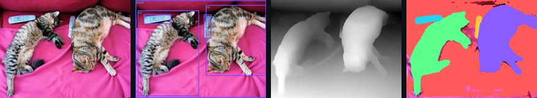

<div align="center">

<a href="https://cagataycali.github.io/strands-transformers/">
  
</a>

<br/>

**Run _any_ HuggingFace transformers model from a Strands agent.**
A tool for every task, or the agent's own multimodal brain. Local. No API keys.

<a href="https://pypi.org/project/strands-transformers/"></a>
<a href="https://github.com/cagataycali/strands-transformers/actions/workflows/docs.yml"></a>
<a href="https://cagataycali.github.io/strands-transformers/"></a>


<a href="https://github.com/cagataycali/awesome-strands-agents"></a>

<a href="https://cagataycali.github.io/strands-transformers/"><b>📖 Docs</b></a> &nbsp;·&nbsp;
<a href="#-60-second-hello"><b>⚡ 60-second hello</b></a> &nbsp;·&nbsp;
<a href="#-see-it-work"><b>👁️ See it work</b></a> &nbsp;·&nbsp;
<a href="#-two-ways-to-use-it"><b>🧩 Two ways</b></a> &nbsp;·&nbsp;
<a href="examples/"><b>🧪 Examples</b></a>

</div>

---

## 🤔 The idea

HuggingFace `transformers` already runs every model on earth. The missing piece
is a **clean, dynamic bridge** into an agent loop - without writing per-model glue
every time. This library is that bridge, two ways:

|  | What it is | You get |
|--|-----------|---------|
| 🛠️ **`use_transformers`** | one tool exposing **every** transformers task | discover · run a pipeline · `call` any class/method |
| 🧠 **`TransformerModel`** | a local model as your `Agent(model=…)` brain | it *sees*, *hears* & *speaks* via content blocks |

> **Zero hardcoding.** `core/registry.py` reads transformers' own `SUPPORTED_TASKS`
> taxonomy at runtime - the day a task or model lands upstream, it works here. No
> code change. No version bump.

## 📦 Install

```bash
uv pip install strands-transformers          # from PyPI
PYTHONPATH=. python examples/smoke.py         # verify → "18/18 checks passed"
```

<details>
<summary>From source · optional extras (audio · vision · training)</summary>

```bash
uv pip install -e .                # editable from source
uv pip install -e ".[audio]"       # soundfile, librosa  (mp3/flac/ogg decode)
uv pip install -e ".[vision]"      # torchvision (needed by VLMs!), opencv, av
uv pip install -e ".[training]"    # trl, peft, accelerate
uv pip install -e ".[all]"         # everything
```

WAV audio works with no extras. **Vision models** (SmolVLM, Qwen-VL, …) need
`[vision]`. `device="auto"` picks cuda → mps → cpu (bf16 on GPU).
</details>

## ⚡ 60-second hello

A 256M-param vision model, *seeing* pixels in the standard Strands loop - no key, no server:

```python
import io
from PIL import Image
from strands import Agent
from strands_transformers import TransformerModel

buf = io.BytesIO(); Image.new("RGB", (64, 64), (20, 200, 40)).save(buf, "PNG")  # a green square

model = TransformerModel(model_path="HuggingFaceTB/SmolVLM-256M-Instruct")
agent = Agent(model=model, system_prompt="You are concise.")

print(agent([
    {"image": {"format": "png", "source": {"bytes": buf.getvalue()}}},
    {"text": "Color? One word."},
]))
# → Green.
```

Swap `model_path` for any HF VLM and the code is identical.

## 👁️ See it work

Every result below is a **real** model output (CUDA · transformers 5.12 · torch 2.10):

| You give it | It returns | Example |
|-------------|-----------|---------|
| 🖼️ a green image + *"Color?"* | `"Green."` | [`multimodal_agent.py`](examples/multimodal_agent.py) |
| 🎬 brightening video frames | `"BRIGHTER."` | [`multimodal_advanced.py`](examples/multimodal_advanced.py) |
| 🧰 a blue tool screenshot (in `toolResult`) | `"Blue."` | [`multimodal_advanced.py`](examples/multimodal_advanced.py) |
| 📄 a text document | recovers `BANANA-42` | [`document_and_audio.py`](examples/document_and_audio.py) |
| 🔊 a 440 Hz tone (Omni) | `"It's a pure tone."` | [`omni_audio.py`](examples/omni_audio.py) |
| 💬 *"say: …can speak"* (Omni) | 🔊 real 24 kHz speech | [`omni_audio.py`](examples/omni_audio.py) |
| 🦾 camera + *"pick the cube"* | actions `[1, 30, 6]` | [`molmoact_vla.py`](examples/molmoact_vla.py) |

<details>
<summary>📋 <b>Copy-paste &amp; run</b> - the snippet behind each row</summary>

```python
# 🖼️ image → "Green."   (local VLM brain, content blocks)
import io
from PIL import Image
from strands import Agent
from strands_transformers import TransformerModel

png = io.BytesIO(); Image.new("RGB", (224, 224), (20, 200, 40)).save(png, "PNG")
agent = Agent(model=TransformerModel(model_path="HuggingFaceTB/SmolVLM-256M-Instruct"))
print(agent([
    {"image": {"format": "png", "source": {"bytes": png.getvalue()}}},
    {"text": "What color is this image? One word."},
]))  # → Green.
```

```python
# 🎬 video → "BRIGHTER."   (a video content block of brightening frames)
import asyncio, numpy as np
from PIL import Image
from strands_transformers import TransformerModel

model = TransformerModel(model_path="HuggingFaceTB/SmolVLM2-500M-Video-Instruct",
                         params={"max_tokens": 48, "do_sample": False})
frames = [Image.fromarray(np.full((224, 224, 3), v, np.uint8)) for v in (10,40,80,120,160,200,230,250)]
msgs = [{"role": "user", "content": [
    {"video": {"format": "mp4", "fps": 2.0, "source": {"bytes": frames}}},
    {"text": "Does this video get brighter or darker? Answer brighter or darker."},
]}]
async def go():
    return "".join([e.get("contentBlockDelta",{}).get("delta",{}).get("text","")
                    async for e in model.stream(msgs)])
print(asyncio.run(go()))  # → ...brighter...
```

```python
# 🧰 tool screenshot → "Blue."   (an image returned inside a toolResult)
import asyncio, io
from PIL import Image
from strands_transformers import TransformerModel

blue = io.BytesIO(); Image.new("RGB", (224, 224), (25, 25, 210)).save(blue, "PNG")
model = TransformerModel(model_path="HuggingFaceTB/SmolVLM-256M-Instruct",
                         params={"max_tokens": 32, "do_sample": False})
msgs = [
    {"role": "user", "content": [{"text": "Capture the screen, then name its color."}]},
    {"role": "assistant", "content": [{"toolUse": {"name": "capture", "toolUseId": "t1", "input": {}}}]},
    {"role": "user", "content": [{"toolResult": {"toolUseId": "t1", "status": "success", "content": [
        {"text": "Here is the captured screen:"},
        {"image": {"format": "png", "source": {"bytes": blue.getvalue()}}}]}}]},
    {"role": "user", "content": [{"text": "Dominant color of the captured screen? One word."}]},
]
async def go():
    return "".join([e.get("contentBlockDelta",{}).get("delta",{}).get("text","")
                    async for e in model.stream(msgs)])
print(asyncio.run(go()))  # → Blue.
```

```python
# 📄 document → recovers "BANANA-42"   (a document content block → text LM prompt)
import asyncio
from strands_transformers import TransformerModel

model = TransformerModel(model_path="Qwen/Qwen3-0.6B", enable_thinking=False,
                         params={"max_tokens": 64, "do_sample": False})
body = b"The secret passphrase for the vault is BANANA-42. Keep it safe."
msgs = [{"role": "user", "content": [
    {"document": {"name": "secret", "format": "txt", "source": {"bytes": body}}},
    {"text": "What is the secret passphrase? Answer with just the passphrase."},
]}]
async def go():
    return "".join([e.get("contentBlockDelta",{}).get("delta",{}).get("text","")
                    async for e in model.stream(msgs)])
print(asyncio.run(go()))  # → BANANA-42
```

```python
# 🔊 text → speech → text   (TTS then ASR, the tool path; the library narrating itself)
from strands_transformers import use_transformers

tts = use_transformers(action="run", task="text-to-audio",
                       model="facebook/mms-tts-eng",
                       inputs="the quick brown fox jumps over the lazy dog")
wav = tts["artifacts"][0]
asr = use_transformers(action="run", task="automatic-speech-recognition",
                       model="openai/whisper-tiny", inputs=wav)
print(asr["content"][0]["text"])  # → "...quick brown fox..."
```

```python
# 🦾 camera + instruction → robot actions [1, 30, 6]   (VLA via the `call` path)
import numpy as np
from PIL import Image
from huggingface_hub import hf_hub_download
from strands_transformers import use_transformers

REPO = "allenai/MolmoAct2-SO100_101"
top  = Image.open(hf_hub_download(REPO, "assets/sample_realsense_top_rgb.png")).convert("RGB")
side = Image.open(hf_hub_download(REPO, "assets/sample_realsense_side_rgb.png")).convert("RGB")
state = [-0.527, 189.14, 181.41, 60.64, -3.60, 1.097]

use_transformers(action="call", target="AutoProcessor.from_pretrained",
    parameters={"pretrained_model_name_or_path": REPO, "trust_remote_code": True}, cache_key="proc")
use_transformers(action="call", target="AutoModelForImageTextToText.from_pretrained",
    parameters={"pretrained_model_name_or_path": REPO, "trust_remote_code": True, "dtype": "float32"}, cache_key="vla")
print(use_transformers(action="call", target="cached:vla.predict_action",
    parameters={"processor": "cached:proc", "images": [top, side],
                "task": "Pick up the lemon and drop it in the red bowl.",
                "state": state, "norm_tag": "so100_so101_molmoact2",
                "inference_action_mode": "continuous", "num_steps": 10})["content"][0]["text"][:200])
# → MolmoAct2ActionOutput ... actions [1, 30, 6]
```

> Omni audio-in + speech-out needs one bigger model -
> see [`examples/omni_audio.py`](examples/omni_audio.py).

</details>

**Vision tasks on one COCO photo** - detection · depth · panoptic segmentation:

<p align="center">
  
</p>

<p align="center">
  
  &nbsp;&nbsp;
  
</p>

<div align="center">
  🎬 video → label &nbsp;·&nbsp; 🔊 <code>text-to-audio</code> then re-transcribed by whisper (the library narrating itself)<br/>
  ▶️ <b><a href="https://cagataycali.github.io/strands-transformers/">Hear it speak &amp; play every example on the docs site →</a></b>
</div>

## 🧩 Two ways to use it

### 🛠️ As a tool - `use_transformers`

```python
from strands import Agent
from strands_transformers import use_transformers

agent = Agent(tools=[use_transformers])
agent("Transcribe recording.wav")                  # automatic-speech-recognition
agent("What's in scene.jpg?")                       # image-text-to-text
agent("Say 'hello from strands' as audio")          # text-to-audio
agent("Detect objects in https://.../street.jpg")   # object-detection
```

Discover everything at runtime (`action="tasks" | "modalities" | "inspect" | …`),
run high-level pipelines, or `call` any class / fn / method for custom models.
→ **[The tool guide](https://cagataycali.github.io/strands-transformers/guide/the-tool/)**

### 🧠 As the agent's brain - `TransformerModel`

Pass `image` / `video` / `audio` / `document` blocks (and media inside a
`toolResult`) - the provider auto-detects the model's processor and routes them.

| Content block | Verified output | Example |
|---|---|---|
| `image` | `"Green."` | [`multimodal_agent.py`](examples/multimodal_agent.py) |
| `video` (with `fps`) | `"BRIGHTER."` | [`multimodal_advanced.py`](examples/multimodal_advanced.py) |
| `image` in `toolResult` | `"Blue."` | [`multimodal_advanced.py`](examples/multimodal_advanced.py) |
| `document` | recovers `BANANA-42` | [`document_and_audio.py`](examples/document_and_audio.py) |
| `audio` *(our schema extension)* | audio → text | [`audio_content_block.py`](examples/audio_content_block.py) |
| `audio` in **and** speech out | hears + **speaks** | [`omni_audio.py`](examples/omni_audio.py) |

→ **[Agent brain](https://cagataycali.github.io/strands-transformers/guide/agent-brain/)** ·
**[Content blocks](https://cagataycali.github.io/strands-transformers/guide/content-blocks/)** ·
**[Audio](https://cagataycali.github.io/strands-transformers/guide/audio/)**

### 🦾 Robotics / VLA - camera + instruction → actions

Two transformers-native layers, both GPU-verified:

- 🧠 **reason** — [Cosmos-Reason2-2B](https://huggingface.co/nvidia/Cosmos-Reason2-2B)
  (a physical-AI VLM) plans over a scene via `run`: *"the red cube is bottom-left,
  move the arm there first."*
- ⚙️ **act** — VLA models expose `predict_action` via `call`:
  [MolmoAct2](https://huggingface.co/allenai/MolmoAct2-SO100_101) → `[1,30,6]`;
  [OpenVLA-7b](https://huggingface.co/openvla/openvla-7b) → 7-DoF (auto 4.x→5.x shims).

🔗 **Full agentic loop** ([`robot_reason_act_agent.py`](examples/robot_reason_act_agent.py)):
Cosmos *plans* over real RealSense frames → MolmoAct *acts* — perception → plan →
action through one tool. *(Lerobot policies like SmolVLA / π0 / GR00T run their own
runtimes — pair with `use_lerobot`.)*
→ **[Robotics guide](https://cagataycali.github.io/strands-transformers/guide/robotics/)**

## 🌟 Featured models

Examples use tiny models so they run in seconds. Point the same code at any current
`library_name: transformers` model - swap the id, the plumbing is identical:

| Modality | Strong open model | How |
|----------|-------------------|-----|
| Vision-language | [`Qwen/Qwen3-VL-8B-Instruct`](https://huggingface.co/Qwen/Qwen3-VL-8B-Instruct) · [`google/gemma-3-4b-it`](https://huggingface.co/google/gemma-3-4b-it) | brain or `run` (image-text-to-text) |
| Speech → text | [`openai/whisper-large-v3-turbo`](https://huggingface.co/openai/whisper-large-v3-turbo) | `run` (automatic-speech-recognition) |
| Audio in + speech out | [`Qwen/Qwen2.5-Omni-3B`](https://huggingface.co/Qwen/Qwen2.5-Omni-3B) | brain (`speak=True`) |
| Multimodal (audio+vision+text) | [`microsoft/Phi-4-multimodal-instruct`](https://huggingface.co/microsoft/Phi-4-multimodal-instruct) | brain |
| Robot actions (VLA) | [`allenai/MolmoAct2`](https://huggingface.co/allenai/MolmoAct2) · [`openvla/openvla-7b`](https://huggingface.co/openvla/openvla-7b) | `call` → `predict_action` |
| Embodied reasoning | [`nvidia/Cosmos-Reason2-2B`](https://huggingface.co/nvidia/Cosmos-Reason2-2B) | `run` (image-text-to-text) |

```python
# swap the tiny demo model for a SOTA one - same code:
model = TransformerModel(model_path="Qwen/Qwen3-VL-8B-Instruct")
```

## 🏗️ How it works

```
strands_transformers/
├── tools/use_transformers.py            # the one @tool: discover · run · call
├── models/transformers.py               # TransformerModel - local multimodal brain
├── types/audio.py                       # audio content-block extension
└── core/{registry,engine,io,compat}.py  # taxonomy · load/cache · I/O · legacy shims
```

Nothing is hardcoded per task - `registry.py` reads transformers' `SUPPORTED_TASKS`
at runtime, so coverage tracks upstream automatically.
→ **[Architecture](https://cagataycali.github.io/strands-transformers/reference/architecture/)** ·
**[API reference](https://cagataycali.github.io/strands-transformers/reference/transformer-model/)**

## 🧪 Examples

Runnable, GPU-verified examples in [`examples/`](examples/) - image, video, audio,
document, Omni speech, VLA, and pipelines. Run any:

```bash
PYTHONPATH=. python examples/<name>.py
```

→ **[Examples & FAQ](https://cagataycali.github.io/strands-transformers/reference/examples/)**

## ⭐ Star history

<a href="https://www.star-history.com/#cagataycali/strands-transformers&Date">
  
</a>

## License

MIT - built with the [Strands Agents SDK](https://github.com/strands-agents/sdk-python)
and [HuggingFace Transformers](https://github.com/huggingface/transformers).

<div align="center">
  <sub>If this saved you a pile of per-model glue code, consider giving it a ⭐</sub>
</div>
