# The agent brain: `TransformerModel`

Make a **local** HuggingFace model the agent's reasoning engine. Full Strands
content-block support - text, image, video, document, audio. No servers, no API
keys, no cloud.

```mermaid
flowchart LR
    subgraph BLOCKS["📥 in"]
        direction TB
        B1["📝 text"]
        B2["🖼️ image"]
        B3["🎬 video"]
        B4["🔊 audio"]
        B5["📄 document"]
    end
    subgraph DETECT["🧠 auto-detect"]
        direction TB
        P1["tokenizer"]
        P2["processor 👁"]
        P3["features 🔊"]
    end
    subgraph OUT["📤 out"]
        direction TB
        O1["📝 text"]
        O2["💭 reasoning"]
        O3["🛠️ tool calls"]
        O4["🔊 speech"]
    end
    BLOCKS --> DETECT --> OUT

    classDef b fill:#7C5CFF22,stroke:#7C5CFF,stroke-width:1.5px,color:#7C5CFF;
    classDef d fill:#22D3EE1f,stroke:#22D3EE,stroke-width:1.5px,color:#0F91A6;
    classDef o fill:#8B8B9414,stroke:#8B8B9466,stroke-width:1.5px,color:#6B6B76;
    class B1,B2,B3,B4,B5 b; class P1,P2,P3 d; class O1,O2,O3,O4 o;
```



## Hello, vision

```python
# /// script
# requires-python = ">=3.10"
# dependencies = ["strands-transformers[vision]"]
# ///
import io
from PIL import Image
from strands import Agent
from strands_transformers import TransformerModel

png = io.BytesIO(); Image.new("RGB", (64, 64), (20, 200, 40)).save(png, "PNG")

model = TransformerModel(model_path="HuggingFaceTB/SmolVLM-256M-Instruct")
agent = Agent(model=model, system_prompt="You are a concise vision assistant.")

print(agent([
    {"image": {"format": "png", "source": {"bytes": png.getvalue()}}},
    {"text": "What color is this image? One word."},
]))
```

```console
$ uv run brain.py
Green.
```

Multimodal is **auto-detected** from the model's processor - you don't flag it.
Streaming, tool-calling, and Qwen3 `<think>` reasoning all work. Text-only
models keep the fast path.

## Configure

```python
model = TransformerModel(
    model_path="Qwen/Qwen3-0.6B",
    device="auto",                       # cuda → mps → cpu, bf16 on GPU
    params={"max_tokens": 512, "temperature": 0.7},
    enable_thinking=False,               # skip <think>… for short answers
)
model.update_config(params={"max_tokens": 1024})   # change anytime
```

!!! warning "Empty reply from a reasoning model?"
    Qwen3 spends tokens inside `<think>…</think>` first. Raise `max_tokens` or
    set `enable_thinking=False`.

## Speech out (Omni)

```python
model = TransformerModel(model_path="Qwen/Qwen2.5-Omni-3B")
model.update_config(speak=True)          # off by default (keeps text fast)
agent([make_audio_block(wav_bytes, 16000), {"text": "what is this sound?"}])
waveform, sr = model.get_last_audio()    # (np.float32, 24000)
```

## Pick a model

| Need | Model |
|------|-------|
| tiny vision (laptop/CPU) | `SmolVLM-256M-Instruct` |
| video | `SmolVLM2-500M-Video` |
| audio in + speech out | `Qwen2.5-Omni-3B` |
| text reasoning | `Qwen3-0.6B … 8B` |

Same code scales to SOTA - just change `model_path`. Any
`library_name: transformers` model works.

---

More in **[Content blocks](content-blocks.md)**, **[Audio](audio.md)**, and the
**[API reference](../reference/transformer-model.md)**.
