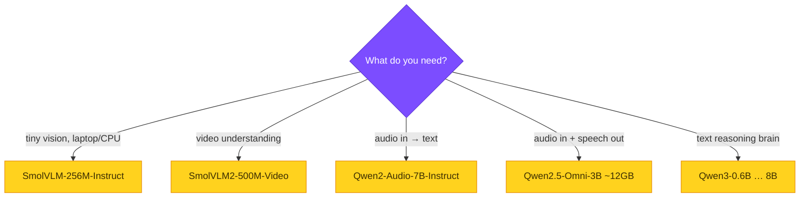

# The agent brain: `TransformerModel`

Make a **local** HuggingFace model the agent's reasoning engine. The provider
implements the full Strands content-block taxonomy — text, image, video,
document — and adds an `audio` block for audio-native models. No servers, no API
keys, no cloud.

```mermaid
flowchart LR
    subgraph BLOCKS["📥 content blocks"]
        direction TB
        B1["📝 text"]
        B2["🖼️ image {format, bytes}"]
        B3["🎬 video {fps, frames}"]
        B4["🔊 audio {bytes, sr}"]
        B5["📄 document {bytes}"]
        B6["🧰 toolResult(image/…)"]
    end

    subgraph DETECT["🧠 TransformerModel — auto-detect"]
        direction TB
        P1["tokenizer<br/><i>text-only</i>"]
        P2["AutoProcessor 👁<br/><i>vision</i>"]
        P3["feature_extractor 🔊<br/><i>audio</i>"]
        P4["Omni Thinker + Talker<br/><i>any-to-any</i>"]
    end

    subgraph OUT["📤 streamed out"]
        direction TB
        O1["📝 text"]
        O2["💭 reasoning &lt;think&gt;"]
        O3["🛠️ tool calls"]
        O4["🔊 speech (Omni)"]
    end

    BLOCKS --> DETECT --> OUT

    classDef b fill:#7C4DFF,stroke:#5b34d6,color:#fff;
    classDef d fill:#FFD21E,stroke:#E68A00,color:#3a2d00;
    classDef o fill:#00E5FF,stroke:#00b3cc,color:#003844;
    class B1,B2,B3,B4,B5,B6 b;
    class P1,P2,P3,P4 d;
    class O1,O2,O3,O4 o;
```



```python
from strands import Agent
from strands_transformers import TransformerModel

model = TransformerModel(model_path="HuggingFaceTB/SmolVLM-256M-Instruct")
agent = Agent(model=model, system_prompt="You are a concise vision assistant.")

result = agent([
    {"image": {"format": "png", "source": {"bytes": png_bytes}}},
    {"text": "What color is this image? One word."},
])
print(result)   # → "Green."
```

Streaming, tool-calling, and Qwen3 `<think>` reasoning are all supported.
Multimodal is **auto-detected** from the model's processor — you don't flag it.
Text-only models keep the fast tokenizer path with zero overhead.

## Example responses

Run any with `PYTHONPATH=. python examples/<name>.py`:

| Input | Script | Real output |
|-------|--------|-------------|
|  + "Color? One word." | `multimodal_agent.py` | `"Green."` |
| 8 frames dark→bright + "brighter or darker?" | `multimodal_advanced.py` | `"BRIGHTER."` |
| tool returns  + "what color?" | `multimodal_advanced.py` | `"Blue."` |
| txt doc "…passphrase is BANANA-42…" + "what passphrase?" | `document_and_audio.py` | `BANANA-42` |

## Choosing a model



`device="auto"` picks **cuda → mps → cpu** (bf16 on GPU). See
**[Content blocks](content-blocks.md)** for every modality, **[Audio](audio.md)**
for speech in/out, and the **[API reference](../reference/transformer-model.md)**.
