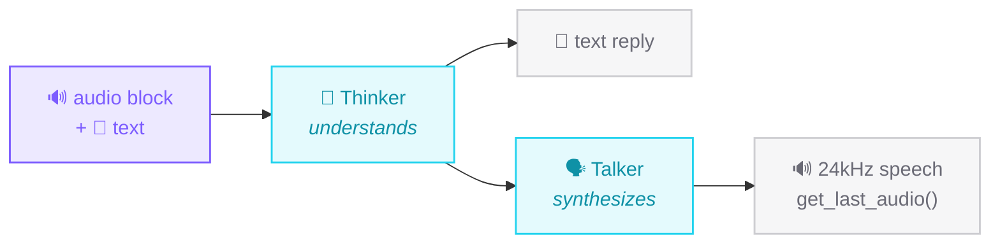

# Audio (in & out)

The Strands / harness-sdk message schema has **no audio content block** (its arms
are text/image/video/document/tool-*). We extend the taxonomy with one shaped
exactly like `image`/`video`, and route it through audio-native models.

## Voice & music gallery - hear it, copy it

Every clip below is a **real, committed model output**. Pick a voice (or a beat),
copy the snippet, run it. Same `use_transformers(action="run", ...)` call - only
the `model` (and prompt) changes.

<div class="st-voices" markdown>

=== "VITS (MMS-TTS)"

    Fast, single-speaker, tiny. The reliable default - no speaker embedding needed.

    ```python
    from strands_transformers import use_transformers

    r = use_transformers(
        action="run",
        task="text-to-speech",
        model="facebook/mms-tts-eng",
        inputs="One tool, every modality. Local, no API keys.",
    )
    print(r["artifacts"])   # -> ['/.../out.wav']
    ```

    <audio controls src="../../assets/audio/mms_tagline.wav"></audio>

=== "SpeechT5 (+ voice clone)"

    Encoder/decoder TTS steered by a 512-d **speaker x-vector** - swap the vector,
    swap the voice. Pass it through `forward_params`.

    ```python
    import torch, numpy as np, io, urllib.request
    import pandas as pd
    from strands_transformers import use_transformers

    # one speaker x-vector (512-d) from cmu-arctic
    url = ("https://huggingface.co/api/datasets/Matthijs/"
           "cmu-arctic-xvectors/parquet/default/validation/0.parquet")
    df = pd.read_parquet(io.BytesIO(urllib.request.urlopen(url).read()))
    spk = torch.tensor(np.array(df.iloc[7306]["xvector"], dtype="float32"))[None]

    r = use_transformers(
        action="run",
        task="text-to-speech",
        model="microsoft/speecht5_tts",
        inputs="Strands transformers turns any Hugging Face model into an agent skill.",
        parameters={"forward_params": {"speaker_embeddings": spk}},
    )
    print(r["artifacts"])
    ```

    <audio controls src="../../assets/audio/speecht5_voice.wav"></audio>

=== "Qwen2.5-Omni (speech out)"

    Not a TTS pipeline - a full multimodal **brain** that *replies* in speech.
    Used as `Agent(model=TransformerModel(...))`; retrieve audio with
    `get_last_audio()`. See [Agent brain](agent-brain.md).

    ```python
    from strands import Agent
    from strands_transformers import TransformerModel

    model = TransformerModel(model_id="Qwen/Qwen2.5-Omni-3B")
    agent = Agent(model=model)
    agent("Say: Strands transformers can speak.")
    model.get_last_audio("reply.wav")   # 24 kHz speech
    ```

    <audio controls src="../../assets/audio/omni_speak.wav"></audio>

=== "MusicGen (music)"

    Not speech at all - `text-to-audio` also covers **music generation**. Describe
    a vibe in words, get back a 32 kHz stereo-ready clip. Longer `max_new_tokens`
    = longer music (~50 tokens/sec).

    ```python
    from strands_transformers import use_transformers

    r = use_transformers(
        action="run",
        task="text-to-audio",
        model="facebook/musicgen-small",
        inputs="lo-fi hip hop beat, warm vinyl crackle, mellow jazzy chords, relaxed",
        parameters={"forward_params": {"max_new_tokens": 256}},  # ~5 s
    )
    print(r["artifacts"])   # -> ['/.../out.wav']  (32 kHz)
    ```

    <audio controls src="../../assets/audio/musicgen_lofi.wav"></audio>

</div>

!!! tip "Why these sound right"
    Audio-output tasks (`text-to-speech`, `text-to-audio`) are pinned to
    **float32** in the engine - half precision (bf16/fp16) mixes dtypes in the
    speaker-embedding and vocoder matmuls and corrupts the waveform.

## The audio content block

`make_audio_block()` builds it; `source.bytes` may be raw container bytes, a mono
numpy waveform, or a `(waveform, sr)` tuple.

```python
from strands_transformers import make_audio_block

block = make_audio_block(waveform, "wav", 16000)
# {"audio": {"format": "wav", "source": {"bytes": waveform, "sampling_rate": 16000}}}
```

## Audio in → text

```python
from strands_transformers import TransformerModel, make_audio_block

model = TransformerModel(model_path="Qwen/Qwen2-Audio-7B-Instruct")
model.stream([{"role": "user", "content": [
    make_audio_block(waveform, "wav", 16000),
    {"text": "Describe what you hear."},
]}])
```

The provider detects audio-native models via the processor's `feature_extractor`,
decodes the payload (WAV via stdlib; mp3/flac/ogg via `soundfile`), resamples to
the model's rate, and emits the `<|AUDIO|>` tokens the model expects.

## Audio in **and** audio out - one model

[Qwen2.5-Omni](https://huggingface.co/Qwen/Qwen2.5-Omni-3B) is any-to-any: one
model *hears* audio in the conversation **and speaks its reply** - text and a
real 24 kHz waveform from a single `generate()`.



```python
# /// script
# requires-python = ">=3.10"
# dependencies = ["strands-transformers[audio]", "numpy"]
# ///
import asyncio, numpy as np
from strands_transformers import TransformerModel, make_audio_block

model = TransformerModel(model_path="Qwen/Qwen2.5-Omni-3B")
sr = 16000
tone = np.sin(2 * np.pi * 440 * np.arange(sr) / sr).astype("float32")  # 1s 440Hz

async def main():
    out = ""
    async for ev in model.stream([{"role": "user", "content": [
        make_audio_block(tone, "wav", sr),
        {"text": "Is this a pure tone or human speech?"},
    ]}]):
        d = ev.get("contentBlockDelta", {}).get("delta", {})
        if "text" in d: out += d["text"]
    print(out.strip())

asyncio.run(main())
```

```console
$ uv run omni.py
It's a pure tone.
```

For **speech out**, set `model.update_config(speak=True)` then read
`wav, sr = model.get_last_audio()` after a turn - a real 24 kHz waveform.

!!! success "Verified end-to-end"
    Omni's spoken reply (the player above), re-transcribed by whisper, reads back
    the words it was asked to say. The provider handles Omni's non-standard
    `generate()` (`thinker_/talker_max_new_tokens`, `(text, audio)` return) for you.

## Audio as a tool (TTS / ASR)

Audio I/O *outside* the conversation goes through `use_transformers`:

```python
# text → speech (.wav path in artifacts)  - produced the tts_hello.wav above
use_transformers(action="run", task="text-to-audio",
                 model="facebook/mms-tts-eng", inputs="hello from strands transformers")

# speech → text
use_transformers(action="run", task="automatic-speech-recognition", inputs="clip.wav")
```

!!! note "Two different things"
    - **Content block** `audio` → consumed *inside* the conversation by an
      audio-native model (this is our schema extension).
    - **Tool** TTS/ASR → audio as an I/O artifact, via standard pipelines.
