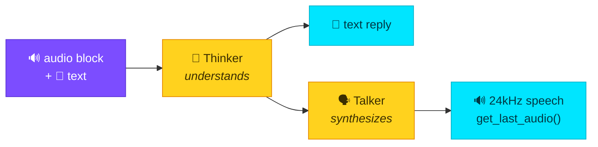

# Audio (in & out)

The Strands / harness-sdk message schema has **no audio content block** (its arms
are text/image/video/document/tool-*). We extend the taxonomy with one shaped
exactly like `image`/`video`, and route it through audio-native models.

## Hear it

These are **real model outputs**, committed to the docs:

| Source | Script | Listen |
|--------|--------|--------|
| `text-to-audio` (mms-tts) "hello from strands transformers" | `examples/multimodal_pipelines.py` | <audio controls src="../../assets/audio/tts_hello.wav"></audio> |
| Qwen2.5-Omni speaking "Strands transformers can speak." | `examples/omni_audio.py` | <audio controls src="../../assets/audio/omni_speak.wav"></audio> |

## The audio content block

`make_audio_block()` builds it; `source.bytes` may be raw container bytes, a mono
numpy waveform, or a `(waveform, sr)` tuple.

```python
from strands_transformers import make_audio_block

block = make_audio_block(waveform, "wav", 16000)
# {"audio": {"format": "wav", "source": {"bytes": waveform, "sampling_rate": 16000}}}
```

## Audio in → text

```python
from strands_transformers import TransformerModel, make_audio_block

model = TransformerModel(model_path="Qwen/Qwen2-Audio-7B-Instruct")
model.stream([{"role": "user", "content": [
    make_audio_block(waveform, "wav", 16000),
    {"text": "Describe what you hear."},
]}])
```

The provider detects audio-native models via the processor's `feature_extractor`,
decodes the payload (WAV via stdlib; mp3/flac/ogg via `soundfile`), resamples to
the model's rate, and emits the `<|AUDIO|>` tokens the model expects.

## Audio in **and** audio out — one model

[Qwen2.5-Omni](https://huggingface.co/Qwen/Qwen2.5-Omni-3B) is any-to-any: one
model *hears* audio in the conversation **and speaks its reply** — text and a
real 24 kHz waveform from a single `generate()`.



```python
from strands_transformers import TransformerModel, make_audio_block

model = TransformerModel(model_path="Qwen/Qwen2.5-Omni-3B")

# audio-in → text-out
model.stream([{"role": "user", "content": [
    make_audio_block(tone, "wav", 16000),
    {"text": "Is this a pure tone or human speech?"},
]}])                              # → "It's a pure tone."

# text-in → text + SPEECH out
model.update_config(speak=True)   # enables the Talker (off by default; keeps text fast)
# ...stream a turn...
wav, sr = model.get_last_audio()  # (np.float32 waveform, 24000)
```

!!! success "Verified end-to-end"
    Omni's spoken reply (the player above), re-transcribed by whisper, reads back
    the words it was asked to say. The provider handles Omni's non-standard
    `generate()` (`thinker_/talker_max_new_tokens`, `(text, audio)` return) for you.

## Audio as a tool (TTS / ASR)

Audio I/O *outside* the conversation goes through `use_transformers`:

```python
# text → speech (.wav path in artifacts)  — produced the tts_hello.wav above
use_transformers(action="run", task="text-to-audio",
                 model="facebook/mms-tts-eng", inputs="hello from strands transformers")

# speech → text
use_transformers(action="run", task="automatic-speech-recognition", inputs="clip.wav")
```

!!! note "Two different things"
    - **Content block** `audio` → consumed *inside* the conversation by an
      audio-native model (this is our schema extension).
    - **Tool** TTS/ASR → audio as an I/O artifact, via standard pipelines.
