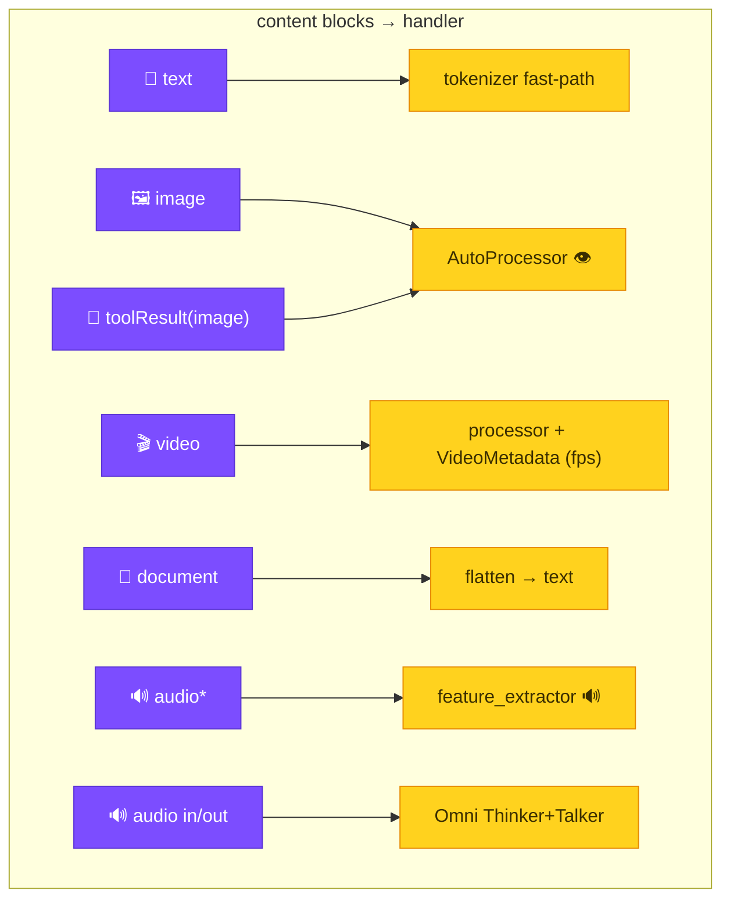

# Content blocks & modalities

`TransformerModel` consumes the full Strands content-block taxonomy. Every output
below is a **real** model result (CUDA · transformers 5.12 · torch 2.10),
reproducible from the matching example.


<sub>* `audio` is our extension to the Strands taxonomy — see [Audio](audio.md).</sub>

## Example responses

| Block | Input | Script | Real output |
|-------|-------|--------|-------------|
| `image` |  "Color? One word." | `multimodal_agent.py` | `"Green."` |
| `video` | 8 frames dark→bright (`fps=2.0`) | `multimodal_advanced.py` | `"BRIGHTER."` |
| `image` in `toolResult` | tool returns  | `multimodal_advanced.py` | `"Blue."` |
| `document` | txt "…passphrase is BANANA-42…" | `document_and_audio.py` | recovers `BANANA-42` |
| `audio` | 440 Hz tone (Omni) | `omni_audio.py` | `"It's a pure tone."` |

## 🖼️ Image

```python
result = agent([
    {"image": {"format": "png", "source": {"bytes": png_bytes}}},
    {"text": "What color is this image? One word."},
])   # → "Green."
```

## 🎬 Video

A `video` block is a list of frames (or a `(T,H,W,C)` array / container bytes).
Provide `fps` so the model builds real frame timestamps.

```python
model.stream([{"role": "user", "content": [
    {"video": {"format": "mp4", "fps": 2.0, "source": {"bytes": frames}}},
    {"text": "Does this video get brighter or darker?"},
]}])   # → "BRIGHTER."
```

## 🧰 Tool-result images (the agentic-vision loop)

A tool returns an image *inside a `toolResult`*; the VLM reasons over it on the
next turn — exactly the loop you want for screen-watchers and camera agents.

```python
{"toolResult": {"toolUseId": "t1", "status": "success", "content": [
    {"text": "Here is the captured screen:"},
    {"image": {"format": "png", "source": {"bytes": blue_png}}},
]}}   # → "Blue."
```

## 📄 Document

```python
{"document": {"name": "secret", "format": "txt",
              "source": {"bytes": b"...the passphrase is BANANA-42..."}}}
# "What is the passphrase?" → recovers "BANANA-42"
```

## 🔊 Audio

See **[Audio (in & out)](audio.md)** — with playable real outputs.

## Supported transformers modalities (the tool)

| Modality | Example tasks |
|----------|---------------|
| **text** | text-generation, fill-mask, token/text-classification, feature-extraction, table-qa |
| **image** | image-classification, depth-estimation, image-feature-extraction, keypoint-matching |
| **audio** | automatic-speech-recognition, audio-classification, text-to-audio |
| **video** | video-classification |
| **multimodal** | image-text-to-text, visual/document-qa, object-detection, segmentation, zero-shot-*, any-to-any |

Run `use_transformers(action="tasks")` for the live, complete list on your install.
