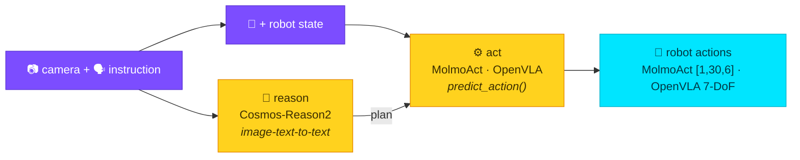

# Robotics / Vision-Language-Action (VLA)

Robotics agents stack two jobs: **reason** about a scene (where is the cube,
what to do first) and **act** (emit joint commands). strands-transformers covers
both — and both are real, GPU-verified.



## Model landscape (today)

| Model | Kind | Loads via | Layer |
|-------|------|-----------|-------|
| [nvidia/Cosmos-Reason2-2B](https://huggingface.co/nvidia/Cosmos-Reason2-2B) | physical-AI reasoning VLM | `run` (image-text-to-text) | 🧠 reason |
| [allenai/MolmoAct2-SO100_101](https://huggingface.co/allenai/MolmoAct2-SO100_101) | VLA (`predict_action`) | `call` | ⚙️ act |
| [openvla/openvla-7b](https://huggingface.co/openvla/openvla-7b) | VLA (`predict_action`) | `call` | ⚙️ act |

!!! info "Reasoning vs action models"
    **Reasoning** models (Cosmos-Reason) are standard `image-text-to-text` VLMs —
    they describe the scene and plan, and run through the high-level `run` path.
    **Action** (VLA) models expose a custom `predict_action` that emits raw joint
    commands, so they go through the low-level `call` path. A good agent uses the
    reasoner to *plan*, then a VLA to *execute*.

## 🧠 Reason — Cosmos-Reason2 (`examples/cosmos_reason_embodied.py`)

NVIDIA's physical-AI VLM (`Qwen3VLForConditionalGeneration`) — a normal
`image-text-to-text` model, so the high-level `run` path just works.

```python
use_transformers(action="run", task="image-text-to-text",
                 model="nvidia/Cosmos-Reason2-2B",
                 inputs={"text": [{"role": "user", "content": [
                     {"type": "image", "image": scene},
                     {"type": "text", "text": "Where is the red cube and what should the arm do first?"},
                 ]}]},
                 parameters={"max_new_tokens": 96, "do_sample": False})
```

| Input | Real output |
|-------|-------------|
| 🟥 red cube lower-left + "where is it, what first?" | *"The red cube is in the bottom left corner of the image, so the robot arm should move to that location first."* |

## ⚙️ Act — VLA models (`examples/molmoact_vla.py`, `examples/openvla_vla.py`)

VLA models take camera images + an instruction (+ robot state) and emit **robot
actions** via a custom `predict_action`, driven through the `call` layer:

```python
# 1) load processor + model once, cache them
use_transformers(action="call", target="AutoProcessor.from_pretrained",
                 parameters={"pretrained_model_name_or_path": REPO, "trust_remote_code": True},
                 cache_key="proc")
use_transformers(action="call", target="AutoModelForImageTextToText.from_pretrained",
                 parameters={"pretrained_model_name_or_path": REPO, "trust_remote_code": True,
                             "dtype": "bfloat16", "device_map": "cuda"}, cache_key="vla")

# 2) call the model's own predict_action with the cached processor
use_transformers(action="call", target="cached:vla.predict_action",
                 parameters={"processor": "cached:proc", "images": [top, side],
                             "state": joint_state, "norm_tag": "so100_so101_molmoact2"})
# → MolmoAct2ActionOutput.actions, shape [1, 30, 6]
```

| Model | Output |
|-------|--------|
| MolmoAct2-SO100_101 | continuous actions `[1, 30, 6]` |
| OpenVLA-7b | 7-DoF action vector |

!!! tip "Ergonomic helpers"
    - `cached:key[.attr]` resolves to live cached objects, including inside
      `parameters` (so `processor="cached:proc"` works).
    - A `"**"` parameter key unpacks a cached mapping into kwargs — the idiomatic
      `model.predict_action(**processor(prompt, image))`.

## Beyond transformers (lerobot ecosystem)

Some popular robot policies — **SmolVLA**, **π0 / π0.5**, **ACT**, **Diffusion
Policy**, **NVIDIA GR00T-N1.7** — ship as [lerobot](https://github.com/huggingface/lerobot)
or Isaac-GR00T checkpoints with their *own* runtimes, not transformers
`AutoModel` classes. They're out of scope for `use_transformers` (which wraps
*transformers*), but pair naturally with [`use_lerobot`](https://github.com/cagataycali)
in the same agent. For transformers-native robotics today, use the three models
above.

For models written against older transformers, see
**[Legacy model compatibility](compat.md)**.
