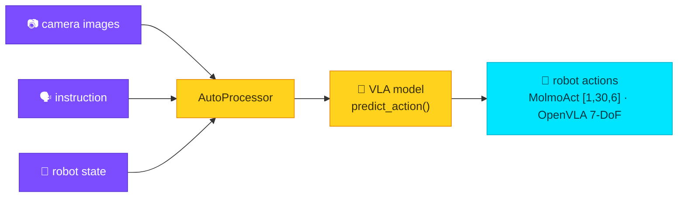

# Robotics / Vision-Language-Action (VLA)

VLA models take camera images + a language instruction (+ robot state) and emit
**robot actions** via a custom `predict_action` method — not a standard pipeline —
so they're driven through the low-level `call` layer.



| Model | Example | Output |
|-------|---------|--------|
| [MolmoAct2-SO100_101](https://huggingface.co/allenai/MolmoAct2-SO100_101) | `examples/molmoact_vla.py` | continuous actions `[1, 30, 6]` |
| [OpenVLA-7b](https://huggingface.co/openvla/openvla-7b) | `examples/openvla_vla.py` | 7-DoF action vector |

```python
# 1) load processor + model once, cache them
use_transformers(action="call", target="AutoProcessor.from_pretrained",
                 parameters={"pretrained_model_name_or_path": REPO, "trust_remote_code": True},
                 cache_key="proc")
use_transformers(action="call", target="AutoModelForImageTextToText.from_pretrained",
                 parameters={"pretrained_model_name_or_path": REPO, "trust_remote_code": True,
                             "dtype": "bfloat16", "device_map": "cuda"}, cache_key="vla")

# 2) call the model's own predict_action with the cached processor
use_transformers(action="call", target="cached:vla.predict_action",
                 parameters={"processor": "cached:proc", "images": [top, side],
                             "state": joint_state, "norm_tag": "so100_so101_molmoact2"})
# → MolmoAct2ActionOutput.actions, shape [1, 30, 6]
```

!!! tip "Ergonomic helpers"
    - `cached:key[.attr]` resolves to live cached objects, including inside
      `parameters` (so `processor="cached:proc"` works).
    - A `"**"` parameter key unpacks a cached mapping into kwargs — the idiomatic
      `model.predict_action(**processor(prompt, image))`.

For models written against older transformers, see
**[Legacy model compatibility](compat.md)**.
