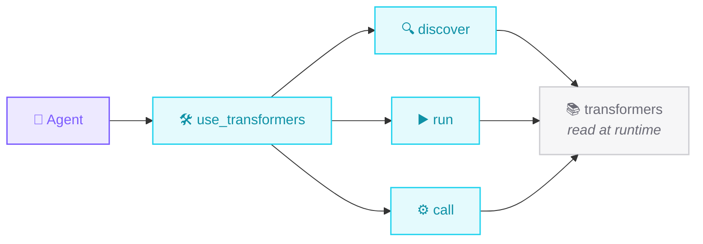

# The tool: `use_transformers`

One `@tool`, the whole library. Three modes: **discover**, **run**, **call**.
Nothing is hardcoded - the task list is read from transformers at runtime.



## Discover

Find the right task and model without memorizing the library.

```python
use_transformers(action="tasks")        # every task + modality + default model
use_transformers(action="task_info", task="image-text-to-text")
use_transformers(action="inspect", target="pipeline")   # signature of anything
```

## Run

High-level pipelines. `inputs` takes a path, URL, base64, text, dict, or array.

```python
use_transformers(action="run", task="automatic-speech-recognition", inputs="clip.wav")

use_transformers(action="run", task="object-detection",
                 inputs="https://images.cocodataset.org/val2017/000000039769.jpg")
```

Vision tasks return structured data **and** save an image you can look at:

<div align="center">
<table>
<tr><th>input</th><th>detection</th><th>depth</th></tr>
<tr>
<td></td>
<td></td>
<td></td>
</tr>
</table>
</div>

```console
$ uv run vision.py
detections: ['remote', 'remote', 'couch', 'cat', 'cat']
depth map saved to: /tmp/strands_transformers/image_*.png
```

## Call

For anything pipelines don't cover - VLA models, custom methods. Load
components once, cache them, chain calls.

```python
use_transformers(action="call", target="AutoProcessor.from_pretrained",
                 parameters={"pretrained_model_name_or_path": MODEL}, cache_key="proc")

use_transformers(action="call", target="cached:vla.predict_action",
                 parameters={"**": "cached:inputs", "unnorm_key": "bridge_orig"})
```

!!! info "Cache shorthands"
    `cached:key` is a live object, `cached:key.method` calls a method on it, and
    `"**"` unpacks a cached mapping into kwargs - the idiomatic
    `model.predict_action(**processor(prompt, image))`.

---

Every call returns `{status, content, data, artifacts}` - `data` is always
JSON-safe. Full signatures in the **[API reference](../reference/use-transformers.md)**.
