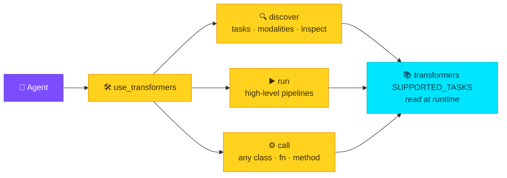

# The tool: `use_transformers`

One `@tool` exposes the entire transformers library three ways: **discover**,
**run** (high-level pipelines), and **call** (low-level any class/fn/method).



| Action | What it does | Example |
|--------|--------------|---------|
| `tasks` / `modalities` | list everything transformers supports | discovery |
| `task_info` / `inspect` / `classes` | drill into a task / signature / Auto* class | discovery |
| `run` | high-level pipeline (ASR, VLM, detection, TTS…) | `multimodal_pipelines.py` |
| `call` | any class/fn/method, with caching (VLA `predict_action`) | `molmoact_vla.py` |
| `compat` | apply legacy 4.x→5.x shims | — |

## Discover (never guess)

```python
use_transformers(action="tasks")        # 24 tasks + modality + auto-model + default
use_transformers(action="modalities")   # tasks grouped: text/image/audio/video/multimodal
use_transformers(action="task_info", task="image-text-to-text")
use_transformers(action="classes")      # all Auto* entrypoints
use_transformers(action="inspect", target="pipeline")   # signature + docs of anything
```

??? example "Live `action=\"tasks\"` output"
    ```text
    🤗 transformers supports 24 tasks (100% coverage):
      • any-to-any                      [multimodal]  default: google/gemma-3n-E4B-it
      • automatic-speech-recognition    [multimodal]  auto: AutoModelForCTC, …SpeechSeq2Seq
      • image-text-to-text              [multimodal]  auto: AutoModelForImageTextToText
      • object-detection                [multimodal]  auto: AutoModelForObjectDetection
      • text-to-audio                   [text]        auto: AutoModelForTextToWaveform
      … 19 more — the list is read from transformers at runtime, so it's never stale.
    ```

## Run — high level (native multimodal pipelines)

Inputs accept **file paths, URLs, base64 data-URIs, raw text, dicts, or arrays**.

```python
# ASR
use_transformers(action="run", task="automatic-speech-recognition", inputs="clip.wav")

# Vision-language
use_transformers(action="run", task="image-text-to-text",
                 model="HuggingFaceTB/SmolVLM-256M-Instruct",
                 inputs={"images": "scene.jpg", "text": "describe this"})

# Text-to-speech → .wav path returned in `artifacts`
use_transformers(action="run", task="text-to-audio",
                 model="facebook/mms-tts-eng", inputs="Hello!")

# Object detection from a URL
use_transformers(action="run", task="object-detection",
                 inputs="https://images.cocodataset.org/val2017/000000039769.jpg")
```

## Call — low level (any class / function / method)

For VLA / robot-action models, or anything pipelines don't cover. Load
components dynamically and cache them across calls:

```python
use_transformers(action="call", target="AutoProcessor.from_pretrained",
                 parameters={"pretrained_model_name_or_path": "model_id"}, cache_key="proc")
use_transformers(action="call", target="AutoModelForImageTextToText.from_pretrained",
                 parameters={"pretrained_model_name_or_path": "model_id"}, cache_key="vla")
use_transformers(action="call", target="cached:vla.predict_action", parameters={...})
```

!!! info "Cache reference helpers"
    - `cached:key[.attr]` resolves to a live cached object, including inside
      `parameters` (so `processor="cached:proc"` works).
    - A `"**"` parameter key unpacks a cached mapping into kwargs — the idiomatic
      `model.predict_action(**processor(prompt, image))`.

See the **[API reference](../reference/use-transformers.md)** for full signatures.
