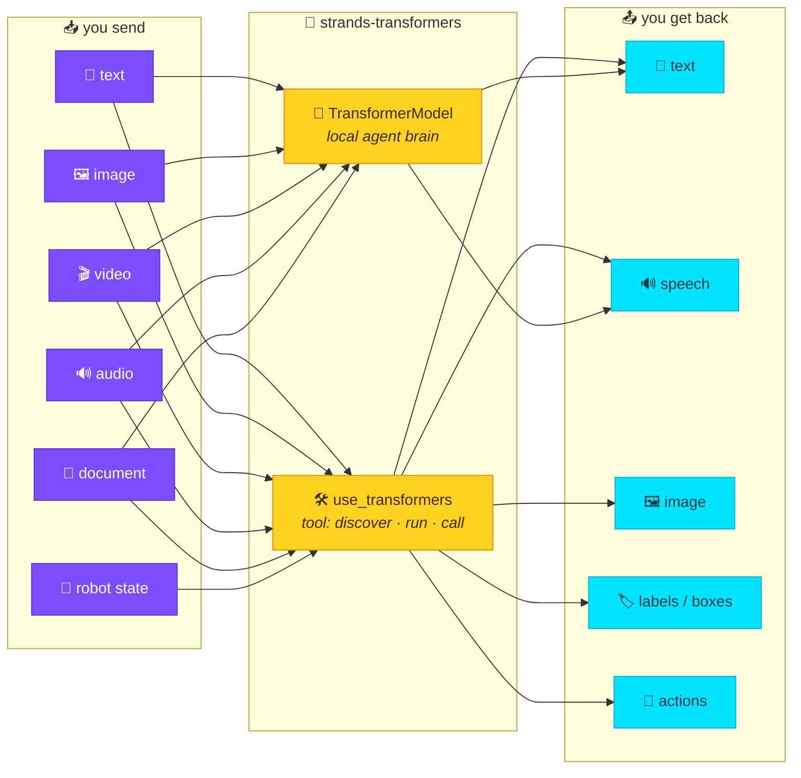

# 🤗 Strands Transformers

**One tool wraps *all* of HuggingFace transformers. One provider makes any local
model a multimodal agent brain.** Agents that see, hear, and speak — 100% task
coverage, zero hardcoding, fully local.

`use_aws` wraps all of boto3. `use_lerobot` wraps all of lerobot.
**`use_transformers` wraps all of HuggingFace transformers** — it reads
transformers' own task taxonomy at runtime, so a new task upstream is supported
here with **no code change**. And `TransformerModel` lets a **local** HF model
*be the agent's brain* — pass image, video, audio, and document content blocks
and the model consumes them. With Qwen2.5-Omni it even **speaks back**.

## See it in one table

Every output is a **real** model result (CUDA · transformers 5.12 · torch 2.10),
reproducible from the matching example.

| You give it | Script | It returns |
|-------------|--------|-----------|
| 🖼️ a green image | `examples/multimodal_agent.py` | `"Green."` |
| 🎬 brightening frames | `examples/multimodal_advanced.py` | `"BRIGHTER."` |
| 🧰 a tool screenshot | `examples/multimodal_advanced.py` | `"Blue."` |
| 📄 a text document | `examples/document_and_audio.py` | recovers `BANANA-42` |
| 🔊 a 440 Hz tone (Omni) | `examples/omni_audio.py` | `"It's a pure tone."` |
| 💬 "say: …can speak" (Omni) | `examples/omni_audio.py` | 🔊 [omni_speak.wav](assets/audio/omni_speak.wav) |

<audio controls src="assets/audio/omni_speak.wav"></audio>
*(Qwen2.5-Omni speaking "Strands transformers can speak." — real model output.)*

## What you can build

- 🗣️ **Voice assistant** — speak to it, it speaks back, one local model (Qwen2.5-Omni).
- 🤖 **Robot controller** — camera frames + an instruction → joint actions (MolmoAct, OpenVLA).
- 👁️ **Screen-watcher agent** — a tool returns a screenshot; the VLM reasons over it.
- 📄 **Document Q&A** — drop a doc content block in the conversation, ask about it.
- 🎬 **Video understander** — pass frames, ask what changes over time.
- 🔌 **Any HF task on tap** — ASR, detection, segmentation, embeddings… via one tool.

All **local** — no API keys, no servers, no per-model glue.

## Why

| | Hand-rolled glue | **strands-transformers** |
|---|---|---|
| New task / model | write an adapter | works, **no code change** |
| Discovery | read model cards | `action="tasks"` / `"inspect"` |
| Multimodal inputs | format per model | content blocks, handled for you |
| Local model as brain | custom provider | `TransformerModel(model_path=…)` |
| Audio in / speech out | bolt on TTS+ASR | native via Qwen2.5-Omni |

## Where to next

- New here? → **[Installation](guide/installation.md)** then **[Quickstart](guide/quickstart.md)**
- See/hear → **[Agent brain](guide/agent-brain.md)**, **[Content blocks](guide/content-blocks.md)**, **[Audio](guide/audio.md)**
- Robotics → **[Robotics / VLA](guide/robotics.md)**
- Internals → **[Architecture](reference/architecture.md)** · **[API reference](reference/transformer-model.md)**
