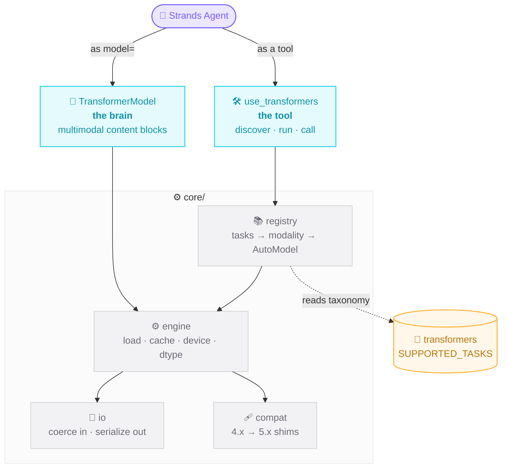

# Architecture

The source of truth is transformers' own `SUPPORTED_TASKS` registry, read at
runtime - nothing is hardcoded per-task. A new transformers task is instantly
available.

| Layer | File | Responsibility |
|-------|------|----------------|
| **Registry** | `core/registry.py` | Reads transformers' task taxonomy → modality → AutoModel. Dynamic class/fn resolution. |
| **Engine** | `core/engine.py` | Loads & caches pipelines/models. Auto device (cuda/mps/cpu) + dtype. |
| **I/O** | `core/io.py` | Coerces multimodal inputs; serializes outputs; saves audio/images to disk. |
| **Provider** | `models/transformers.py` | `TransformerModel` - local model as the agent brain, multimodal content blocks. |
| **Types** | `types/audio.py` | Audio content-block extension to the Strands taxonomy. |
| **Tool** | `tools/use_transformers.py` | The single `@tool` agents call. Discovery + run + call. |

## Request flow (the brain)

1. `Agent` passes content blocks to `TransformerModel.stream(...)`.
2. The provider inspects the blocks and the model's processor to pick a path:
   text tokenizer · vision `AutoProcessor` · audio `feature_extractor` ·
   Omni Thinker+Talker.
3. Inputs are coerced (image bytes → PIL, video → frames + `VideoMetadata`,
   audio → resampled waveform), the model generates, and tokens stream back as
   standard Strands events (text, reasoning, tool calls). Omni additionally
   stashes a speech waveform retrievable via `get_last_audio()`.
